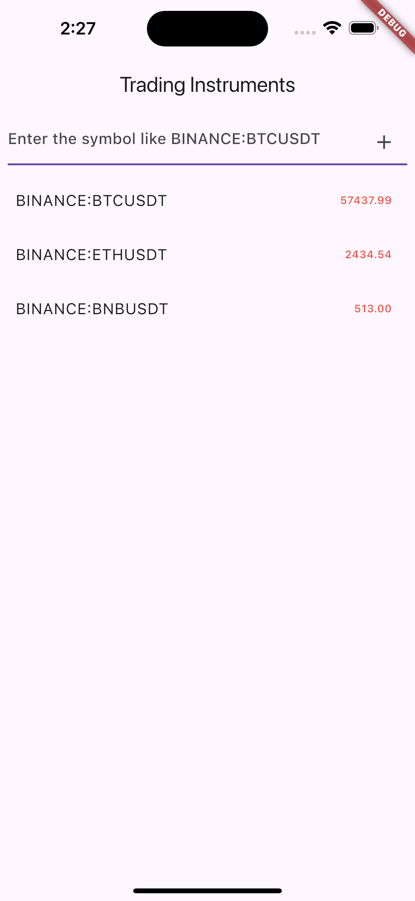

# Trading App

## Project Overview

The Trading App is a Flutter-based application that allows users to track and manage various trading instruments. The app connects to a WebSocket service to receive real-time price updates for selected instruments, which are displayed in a user-friendly interface. This README provides an overview of the project structure, its working principles, and the implementation of the SOLID design pattern throughout the codebase.

## Project Structure

The project is organized into several key directories:

```
trading_app/
│
├── lib/
│   ├── core/
│   │   ├── models/                # Data models used across the app
│   │   ├── services/              # Services such as WebSocket service
│   │   └── utils/                 # Utility functions and classes
│   │
│   ├── features/
│   │   └── trading/
│   │       ├── data/              # Providers and data management for trading
│   │       ├── presentation/      # UI components (pages, widgets)
│   │       └── domain/            # Business logic and use cases (It can be added when the app extended)
│   │
│   ├── main.dart                  # Entry point of the application
│   └── routes.dart                # Application route management (It can be added when the app extended)
│
├── test/                          # Unit and widget tests
└── ios/                           # iOS platform-specific files
```

### Key Directories

- **lib/core/models/**: Contains the data models used across the application. These models define the structure of the data objects (e.g., `TradingInstrument`) that the app operates on.

- **lib/core/services/**: Includes services such as the WebSocket service (`WebSocketService`). These services handle external communications and other background tasks.

- **lib/features/trading/**: This is the main feature of the app and is further divided into:
    - **data/**: Manages state and data handling, including the `TradingProvider`.
    - **presentation/**: Contains UI components, such as pages and widgets like `TradingHomePage` and `TradingListTile`.
    - **domain/**: Encapsulates the business logic and use cases specific to trading. (it's good to add to the project)

- **lib/main.dart**: The entry point of the application. It sets up the necessary providers and initializes the app.

- **lib/routes.dart**: Manages the routes and navigation within the application. (We don't have it yet cause it's a single page app)

## How It Works

The app starts by initializing the Flutter environment and loading necessary configurations (e.g., environment variables from `.env`). It then builds the main widget tree, which includes setting up providers for state management.

### WebSocket Service

The `WebSocketService` class is responsible for connecting to a WebSocket endpoint to receive real-time trading data. It uses an abstract interface (`IWebSocketService`) to adhere to the Dependency Inversion Principle (DIP) of SOLID, allowing for easy substitution with mock services during testing.

### State Management

State management is handled using the `Provider` package. The `TradingProvider` class listens to the WebSocket stream and updates the UI when new data is received. It also allows users to add or remove trading instruments they wish to track.

### UI

The UI is composed of Flutter widgets that interact with the `TradingProvider` to display real-time data. For instance, `TradingHomePage` presents a list of instruments with their latest prices, allowing users to add new instruments via a search bar.

## SOLID Design Principles

The project follows SOLID principles to ensure maintainable, scalable, and testable code:

1. **Single Responsibility Principle (SRP)**:
    - Each class and module in the project has a single responsibility. For example, `TradingProvider` is solely responsible for managing trading-related state, while `WebSocketService` handles WebSocket communication.

2. **Open/Closed Principle (OCP)**:
    - The classes are open for extension but closed for modification. For instance, `WebSocketService` can be extended or replaced without altering its internal implementation, thanks to the `IWebSocketService` interface.

3. **Liskov Substitution Principle (LSP)**:
    - Interfaces and abstract classes, like `IWebSocketService`, ensure that derived classes can be used interchangeably without altering the correctness of the program.

4. **Interface Segregation Principle (ISP)**:
    - The interfaces are designed to be small and specific. `IWebSocketService` provides only the necessary methods (`subscribe`, `unsubscribe`, `dispose`) without forcing implementations to depend on methods they don't use.

5. **Dependency Inversion Principle (DIP)**:
    - High-level modules, like `TradingProvider`, do not depend on low-level modules but on abstractions (interfaces). This allows for better decoupling and easier testing, as demonstrated by the use of mock services in tests.

## How to Run

### Prerequisites

- **Flutter SDK**: Make sure you have Flutter installed on your machine.
- **CocoaPods**: Required for iOS development.

### Running the App

1. **Install dependencies**:

   ```bash
   flutter pub get
   ```

2. **Set up iOS dependencies** (if targeting iOS):

   ```bash
   cd ios
   pod install
   ```

3. **Run the app**:

   ```bash
   flutter run
   ```

### Running Tests

To run unit and widget tests:

```bash
flutter test
```

We have two bash file for clear up the flutter before run the code and for mock test that we can run it for test

```bash
sh flutter-clearup.sh //For clear up the flutter projext
sh flutter-test-mock-build.sh //For generate a mock data
```





--- 

## API Information

This app uses the [Finnhub Stock API](https://finnhub.io/) to fetch real-time stock data via WebSocket. The API provides financial data, including stock prices, forex rates, and cryptocurrency prices, which are crucial for the functionality of this app.

### Setting Up the API Key

To use the Finnhub API, you need to obtain an API key by signing up on the [Finnhub website](https://finnhub.io/). Follow these steps:

1. **Sign Up for Finnhub**:
    - Visit the [Finnhub website](https://finnhub.io/).
    - Sign up for a free account to get access to an API key. Depending on your needs, you can also choose a paid plan for more features.

2. **Obtain Your API Key**:
    - After signing up, log in to your Finnhub account.
    - Go to the API section in your account dashboard and copy your API key.

3. **Configure the API Key in the App**:
    - Create a `.env` file in the root directory of your Flutter project.
    - Add your API key to the `.env` file as follows:

      ```env
      FINNHUB_API_KEY=your_finnhub_api_key_here
      ```

4. **Make Sure the `.env` File is Not Committed to Git**:
    - The `.env` file should be listed in `.gitignore` to prevent it from being committed to version control:

      ```plaintext
      .env
      ```

5. **Using the API Key in the App**:
    - The app is configured to load the API key from the `.env` file using the `flutter_dotenv` package.
    - The key is used to establish a WebSocket connection to Finnhub for fetching real-time trading data.
